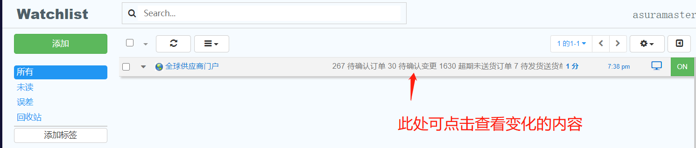

## 安装介绍
1. 将压缩包解压，打开【安装说明.html】文件，查看打开方法

## 获取插件通知服务
- 1. 进入谷歌浏览器内，如果您的浏览器输入地址栏的左侧，是如下分布

- 2. 如果此时出现类似水滴状的插件，点击该插件，出现弹窗，点击红色箭头指向的按钮，
- 
3. 进入到该界面，如下图所示。
- 
4. 您可以去官网进行注册，这样可以利用邮箱接收通知
- [https://app.distill.io/login](https://app.distill.io/login) 

## 核心功能-介绍
1. 进入三一系统的首页，[三一],(http://gsp.sany.com.cn)。
2. 输入您的用户名与密码，并且点击【登录】按钮前，勾选【记住登录yong'hu】，如下图所示。
- 
3. 进入后台系统的页面内，此时点击该插件，在弹出框中点击【select parts of page】如下图所示
- 
4. 进行鼠标拖动与点击，按照下方图片文字【鼠标停留】，鼠标移动到该店并点击。
- 
5. 观察您选择的内容和下方图片中选取的内容是否一致，如果不同，则点击右下方【保存选择】右侧的【关闭按钮】，再重复步骤3与步骤4.
6. 如果您选的文本与下方截图类似,则点击浏览器右下方的【保存选择按钮】
- 
7. 点击保存选择按钮后，插件自动跳转如下如所示
- 
8. 设置名字，请您规定符合自身需求的名字
9. 安排指的是时间安排，其中下拉框设置为【Interval】,右侧时间间隔请您手工调整为一分钟，如下图所示
- 
10. 添加操作，请您务必选择【播放音频剪辑】【显示通知弹出窗口】，而【获取电子邮件】需要您提前注册好账号
11. 点击【保存按钮】，进入下图展示的页面，此时开始每分钟检测内容变化
- 
12. 当插件解析到文本内容发生变化时，会提醒
- 

## 使用须知
1. 因为每分钟检测变化，但是部分文本内容缺省值为0，此意味着页面还未访问到数据库中数据时，插件已经获取文本的缺省值0，因此会给您造成额外的查看负担。
2. 该插件具体使用方法点击查看：[web-monitor](https://distill.io/kb/help/distill-chrome-extension/)